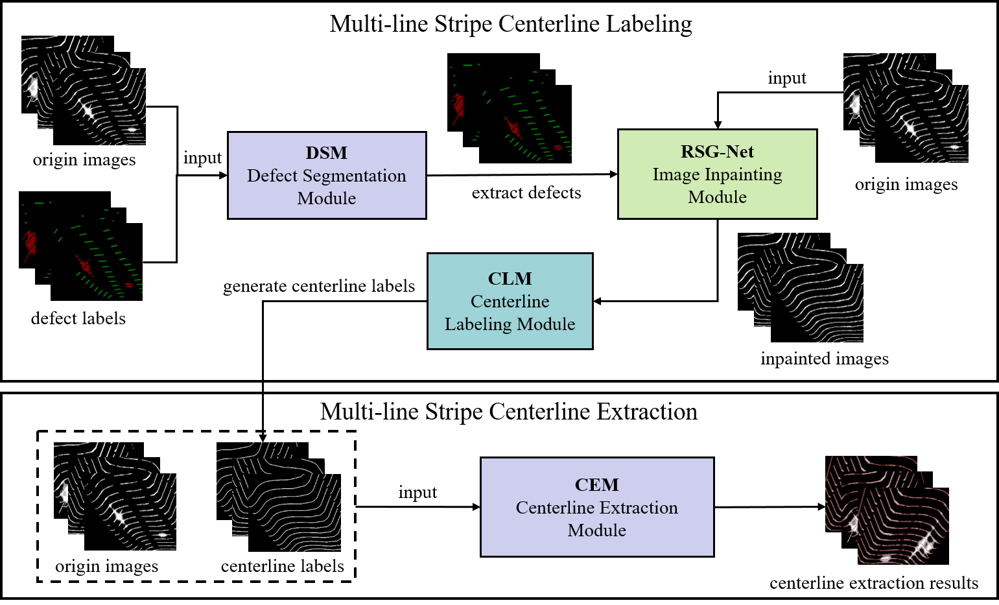

<p align="center">
    <h1 align="center">MSCEF: A Novel Multiline Stripe Centerline Extraction Framework based on Deep Learning.</h1>
</p>


## Overview

This repository is dedicated to the pursuit of wheelset wear assessment via 3D reconstruction. In this endeavor, the pivotal aspect involves the extraction of the laser stripe's centerline, which plays a critical role in achieving accurate 3D reconstruction and subsequently influences the precision of the wear evaluation. To address this challenge, we propose MSCEF, a framework designed to facilitate multi-line laser stripe centerline labeling and centerline extraction.




## 1. Getting Started

Clone the repo:

```bash
git clone git@github.com:Linuxer888/MSCEF.git
```

## 2. Requirements

Install all dependent libraries:

```bash
pip install -r requirements.txt
```

## 3. Experimental Results

### Comparison between MSCEF and traditional methods


### Comparison between MSCEF and other segmentation models

The illustration below displays 5 sets of experimental data. The top row showcases the original wheelset images containing flares and fractures, with the red frame denoting certain defects in the images. The second row exhibits a magnified view of the defect enclosed within the red box. Finally, the third row presents the corresponding ground truth data.


The figure below shows the centerline extraction results of **unet**, **attention unet**, **unet2+**, **unet3+**, and **MSCEF**, respectively.

